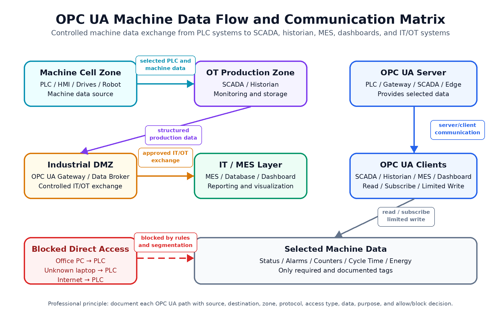

# OPC UA Machine Data Flow and Communication Matrix

A conceptual OPC UA documentation project showing how selected machine data can move from PLC-based machine systems to SCADA, historians, MES, dashboards, databases, and IT/OT systems through controlled and documented communication paths.

This project focuses on OPC UA server/client roles, structured machine data modeling, safe tag exposure, communication matrices, firewall rule examples, and access-control principles.



## Purpose

The purpose of this project is to document a simplified OPC UA-based machine data flow for a PLC-controlled production environment.

The project demonstrates how production data can be exposed in a structured and controlled way without giving uncontrolled direct access to PLCs or machine networks.

## Main Concepts

- OPC UA Server / Client architecture
- PLC-to-SCADA and PLC-to-MES data flow
- OPC UA Address Space and structured machine data
- Safe exposure of selected PLC and machine data
- Read, Subscribe, and Limited Write access
- Communication matrix documentation
- Firewall rule examples
- Access control and secure IT/OT exchange

## Example Architecture

```text
Machine Cell Zone
PLC / HMI / Drives / Robot
        ↓
OT Production Zone
SCADA / Historian / OPC UA Server
        ↓
Industrial DMZ
OPC UA Gateway / Data Broker
        ↓
IT / MES Layer
MES / Database / Dashboard
```

## OPC UA Role Model

| Component | Role | Example Systems |
|---|---|---|
| OPC UA Server | Provides selected structured data | PLC, gateway, SCADA, edge device, data broker |
| OPC UA Client | Reads, subscribes to, or writes selected values | SCADA, historian, MES, dashboard, database connector |

Important principle:

```text
Server provides data.
Client consumes data.
Client may write only selected values if explicitly allowed and validated.
```

## Example Machine Data

| Category | Example Data | Purpose |
|---|---|---|
| Status | Running, FaultActive, Mode, AlarmCode | Monitoring and alarms |
| Production | PartCounter, RejectCounter, CycleTime | Production tracking |
| Energy | PowerConsumption, Current, Voltage | Energy monitoring |
| Robot | RobotReady, RobotFault, ProgramNumber | Robot status |
| MES Context | OrderNumber, RecipeNumber, BatchNumber | Traceability and production context |

## Documentation

- [Architecture Overview](docs/architecture_overview.md)
- [Data Flow Explanation](docs/data_flow_explanation.md)
- [Address Space and Data Model](docs/address_space_and_data_model.md)
- [Security and Access Control](docs/security_and_access_control.md)
- [Assumptions and Limitations](docs/assumptions_and_limitations.md)
- [OPC UA Communication Matrix](tables/opc_ua_communication_matrix.md)
- [Exposed Machine Data](tables/exposed_machine_data.md)
- [Firewall Rule Examples](tables/firewall_rule_examples.md)

## Scope

This is a conceptual documentation project. It is not a deployable plant design.

Real implementations require plant-specific validation, vendor-specific configuration, cybersecurity review, certificate management, firewall validation, change management, and operational approval.
